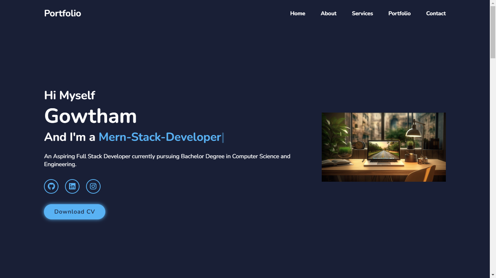

# Personal_portfolio

### 🔗 **Live preview** of the project is [here](https://gowtham6477.github.io/Personal_portfolio/).

## About the Project
**This is my personal portfolio website designed to showcase:**

- **About Me** – My journey, skills, and aspirations.
- **What I Do** – Technologies and tools I specialize in.
- **Projects** – Highlights of my best work.
- **Let’s Connect Form** – Easy contact options for collaboration
## Features

- **Responsive Design**: Mobile-friendly and adapts to all screen sizes.
- **Interactive UI**: Smooth transitions and animations.
- **Contact Form**: Built-in form for easy communication.
- **Projects Section**: Displays my work with live previews and GitHub links.

### **Outcome:**
- **HTML5**: Structuring the web page.
- **CSS3**: Styling and layout design.
- **JavaScript**: Interactive and dynamic functionalities.
